# GMT Motor Test Kit 使用手冊

*update: 2022.09.12*

###### tags: `GMT TestKit`

[toc]

## **APP Download Link**

[github v0.1.2.0:arrow_left:](https://github.com/billwanggithub/GMT_Motor_Testkit_Release_new/blob/734c45547d51db5c5877ebc9edfd80e7e85bcaa7/APP/motor_testkit_v0.1.2.0.7z)

---

## **Features**

* Cycle by Cycle RPM recording
* Integrated Power Supply Control
* Current Meaurement by build-in ADC
* Histogram for startup test result
* Error Capturing on startup test
* Realtime plot of RPM and current

---

## **Startup test**

### 測試參數定義

#### `Pole Pairs`

> 提供FG頻率換算RPM
>
> :bulb:RPM計算公式如下
>
> $RPM = \frac{FG\ Frequency(Hz) * 60}{Pole\ Pairs}$

#### `Duty On/Off Stuff`

> 
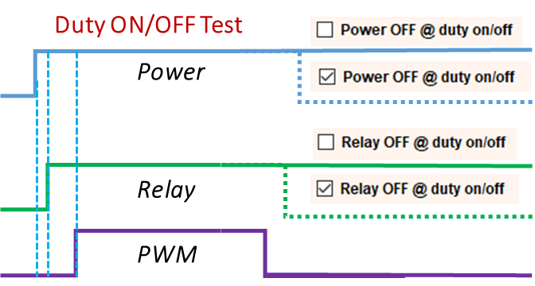

#### `Power On/OFF Stuff`

> 
>

#### `RPM Limit`

> 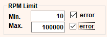
> 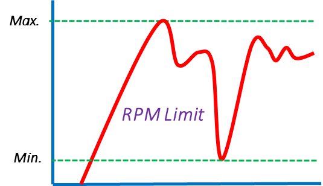

#### `Max. 1st FG Time/Start Stall Time`
>
> :bulb:Start Stall Time
啟動時超過Stall Time時,尚未看到第一個FG變化,會停止本次測試跳到下一次測試
>:bulb:Max. 1st FG Time
啟動時若第一個FG變化超過Max. 1st FG Time,不會停止本次測試,若error有勾選會記錄

 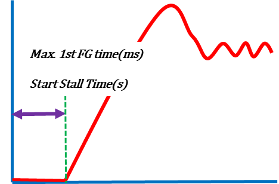

#### `Running RPM error`

>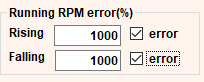 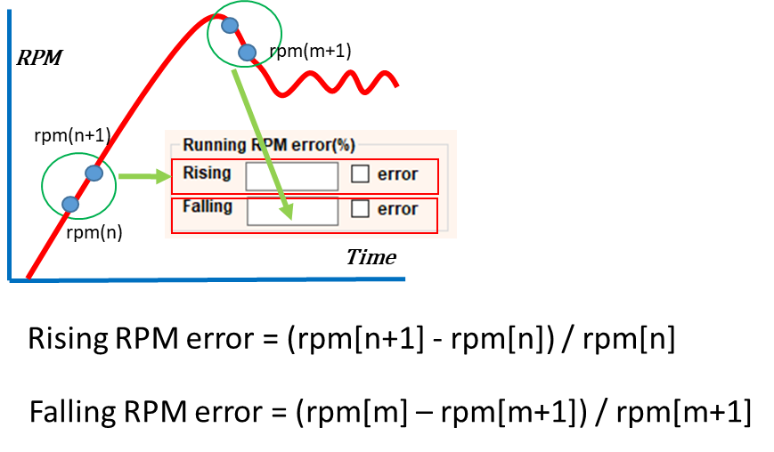

#### `Auto Stable Test`

>**Note:** 有Enable時,達成[穩定測試條件](https://hackmd.io/VTtx3Je1R2-bkXGfu2KUkg?both#%E8%BD%89%E9%80%9F%E7%A9%A9%E5%AE%9A%E6%A2%9D%E4%BB%B6)時會停止本次測試跳到下一次測試
>
>

##### 誤差計算方式

> 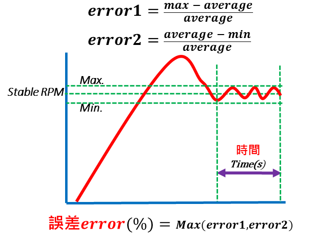

##### 轉速穩定條件

> :bulb: **在設定的時間(Time)內的RPM的平均值與此時間內的最大RPM的誤差(error1)或最小RPM的誤差(error2)均要小於設定值(error)**

#### `Snapshot`

>
>
>:bulb: 每次測試RPM曲線儲存成png圖檔

---

### Basic Test

 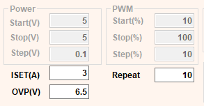

---

### Sweep Test


* 設定ON/OFF Mode

  

* 設定Duty及Power測試參數

  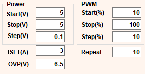

:::success
ON/OFF Mode

* Duty

```csharp
foreach (power in power list)
{
    foreach (duty in duty list)
    {
        //Max. Test Time是否超過?
        //Enable Auto Test Enabled => RPM是否穩定?
        //紀錄RPM,電流,電壓,Duty..
    }
}
```

* Voltage

```csharp
foreach (duty in duty list)
{
    foreach (power in power list)
    {
        //Max. Test Time是否超過?
        //Enable Auto Test Enabled => RPM是否穩定?
        //紀錄RPM,電流,電壓,Duty..
    }
}
```

:::

---

### Lookup table Test

* 先做一次 Fancurve test
  * 設定 Sweep type: Duty or Power
  * 只要勾選UP即可.設定每一步的測試時間(Sampling time )

    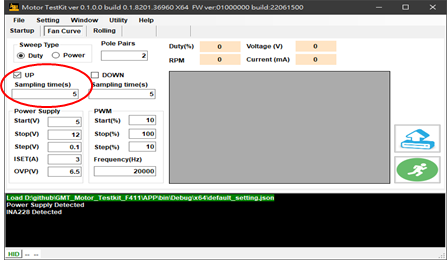
    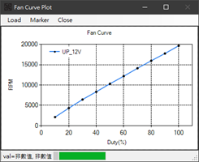

  * 觀察每個step轉速是否穩定,視需要加減Sampling Time

    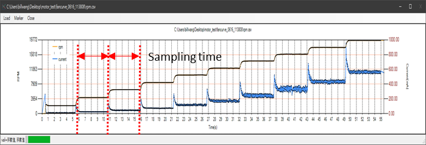
  
  * 結果會存成 fancurve***.csv
    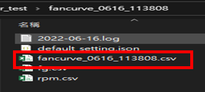

* 切換到Startup Test. 勾選 Lookup table
    

* 切換到Lookup Table. 載入fan curve table.
    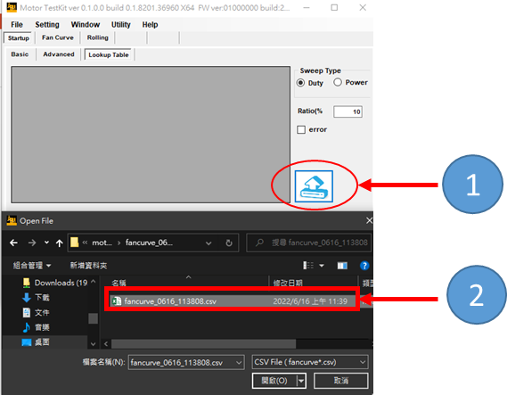

* 設定Final RPM與Target RPM的±誤差範圍
    > ***Target RPM相關測試參數***
        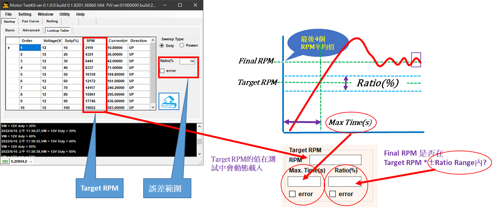

* 點擊測試按鈕
    

---

## **Fancurve test**

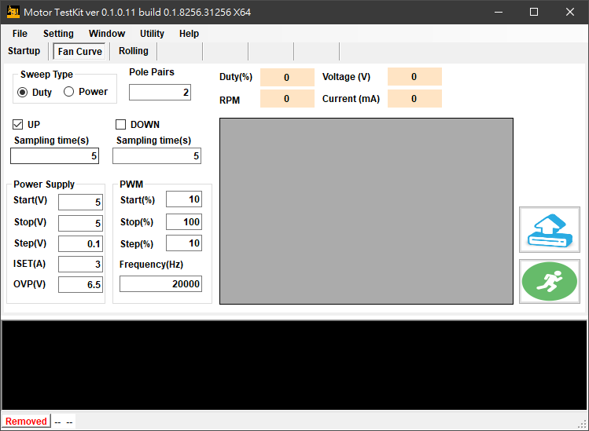

### **Sweep Type**

:::success

#### Duty

```csharp
foreach (power in power list)
{
    foreach (duty in duty list)
    {
        Delay(sampling time)
        //紀錄RPM,電流,電壓,Duty..
    }
}
```

#### Voltage

```csharp
foreach (duty in duty list)
{
    foreach (power in power list)
    {
        Delay(sampling time)
        //紀錄RPM,電流,電壓,Duty..
    }
}
```

:::

---

## **Rolling Test**

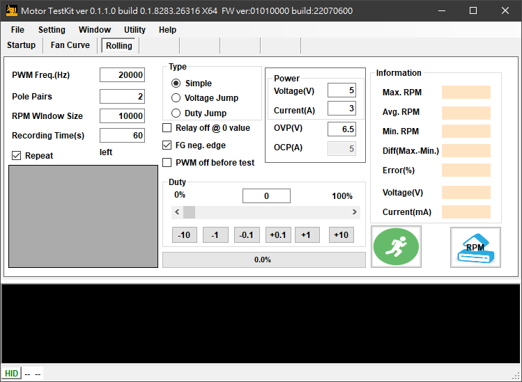


:::info
:bulb: RPM Window Size: RPM視窗內的RPM點數
:::

### Simple

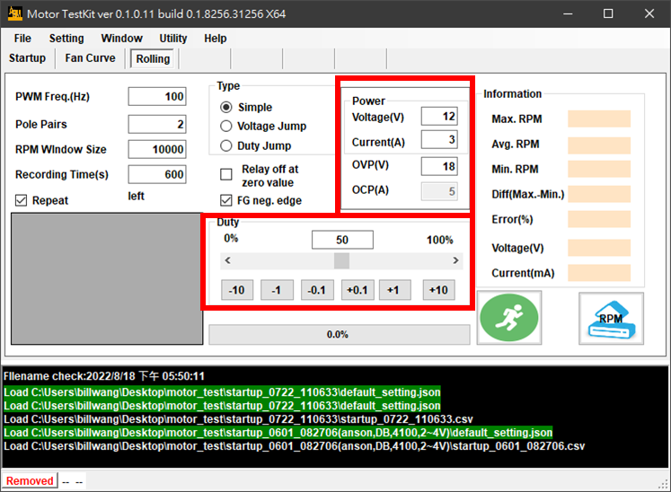

### Duty Jump

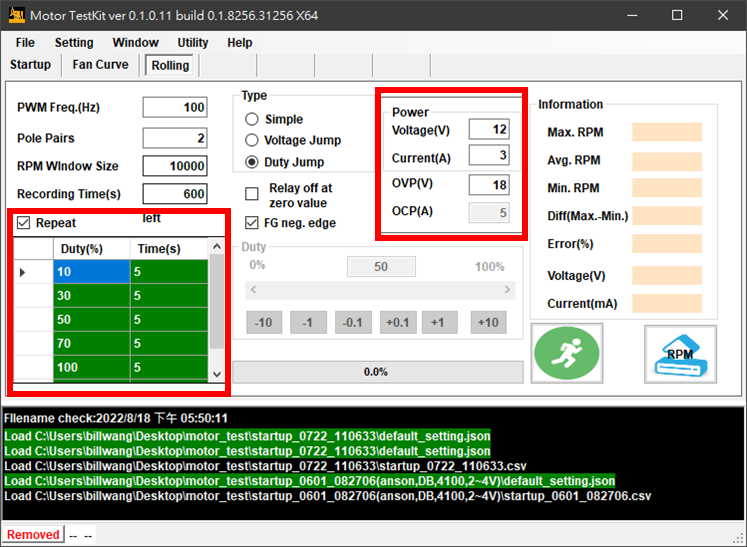

### Voltage Jump

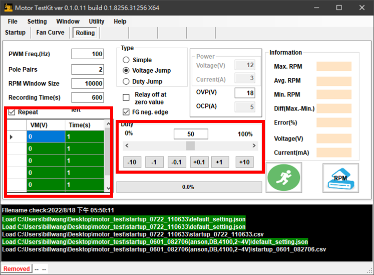

---

## **Others**

:bulb: Startup Test Histogram可儲存成csv格式
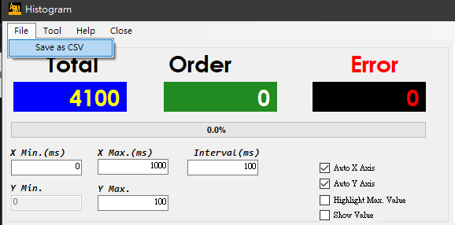

:bulb:　使用 CTRL+ALT+Z 截圖到 Clipboard
> 把鼠標移動到你要的圖上 再按CTRL+ALT+Z

:bulb:　Startup Test測試表格相關功能
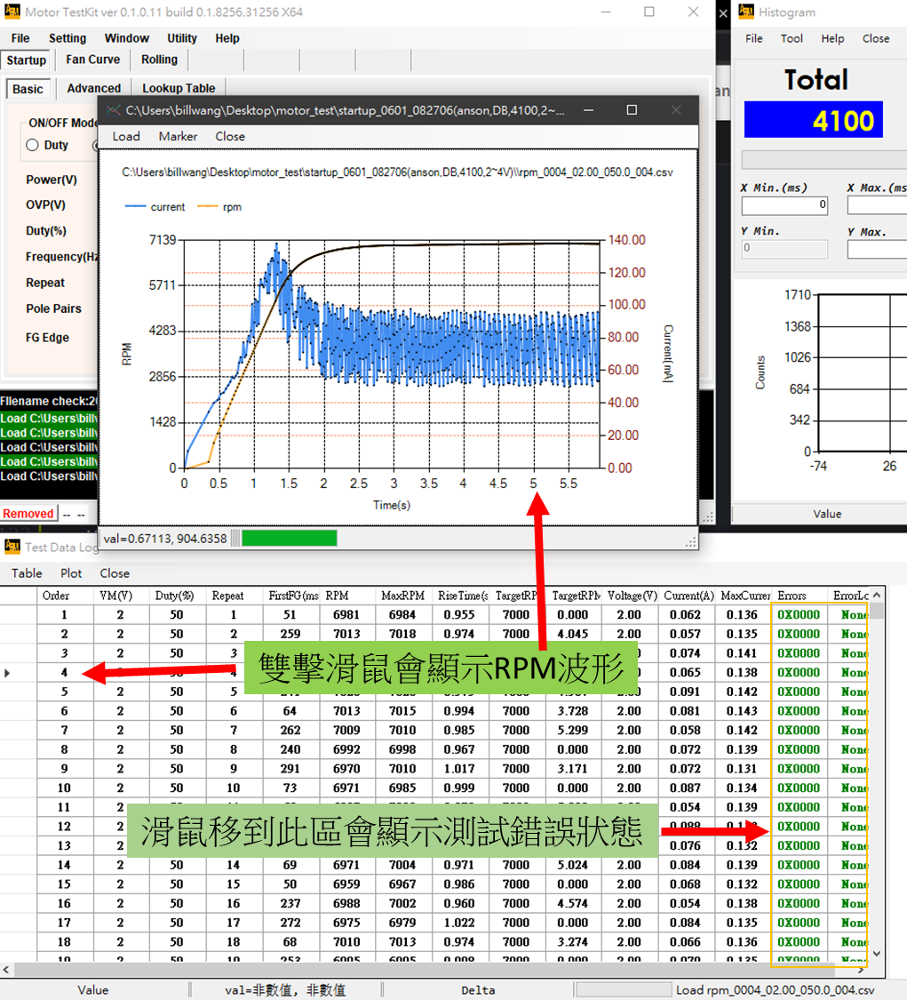

---

## **Firmware更新**

//TBD

---

## **TODO**

* 電流紀錄 Option:Buildin ADC or Power Supply

* 雙風扇量測

---

## **Release Notes**

* v0.1.2.0, 221012
  * Add INA226 current sensor support
  * 修改PWM scrollbar

* v0.1.1.2, 220912
  * 修正rolling jump datalog 同步問題

* v0.1.1.1, 220907
  * 修正rolling duty jump時無data log問題
* v0.1.1.0, 220905
  * 加入在測試前調整PWM   Duty是否輸出的選項
* v0.1.0.11, 220809
  * 加入 rolling duty/voltage datalog
  * 修正 rolling duty/voltage datatable null value問題
* v01010, 220726
  * 修正Rolling mode PWM frequency輸入問題
* v0109, 220725
  * show warning if file is locked when loading startup test log
  * copy fancurve file to startup test if enable lookup table
* v0108, 220722
  * rpm plot 圖例改成靠上水平排列
* v0107, 220721
  * 使用 power Supply 電流給fancurve/startup datalog表格
  * 修正 final rpm reading 有時候會0問題
  * 使用 CTRL+ALT+Z 截圖到 Clipboard
* v0106, 220720
  * 修正running rpm rising/falling error 顯示問題
  * startup增加error description
  * 修正Normal Trigger 有時候會不見問題

---
Feel free to ping us for questions:

* :mailbox: bill.wang@gmt.com.tw
